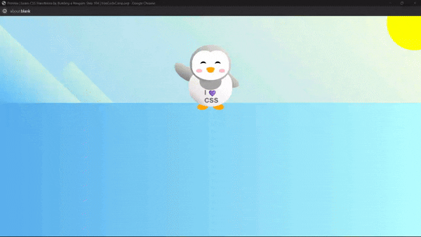

I have finished my study camp on <a href="https://www.freecodecamp.org/" style>FreeCodeCamp.org</a> 
and now, I have completed Learn CSS Transforms by building a Penguin <a href="https://www.freecodecamp.org/learn/2022/responsive-web-design/learn-css-transforms-by-building-a-penguin" style>#FreeCodeCamp</a>

